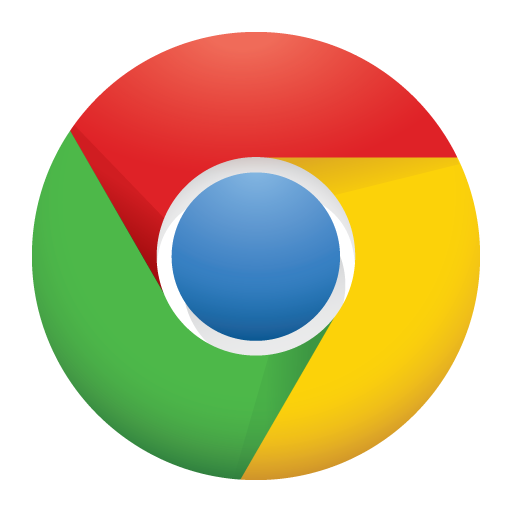
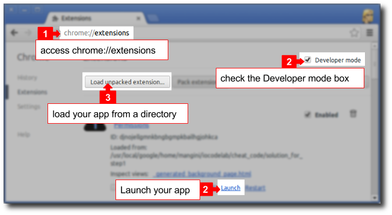
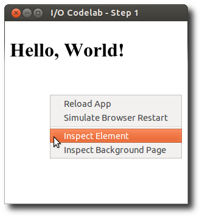
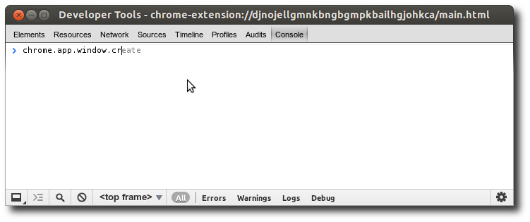
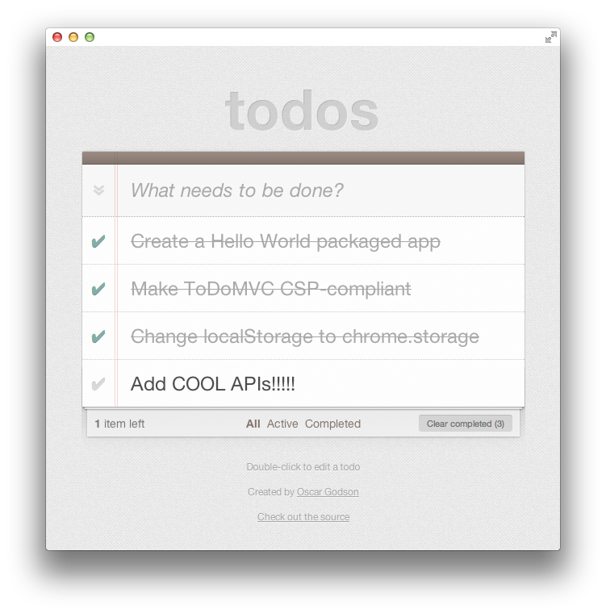
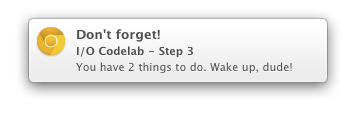
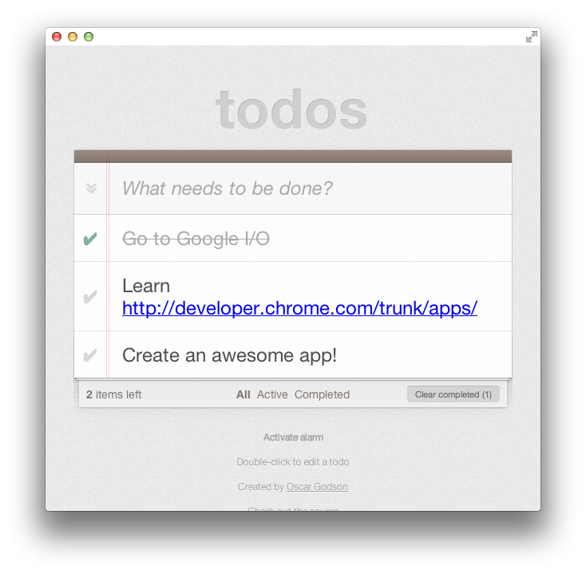
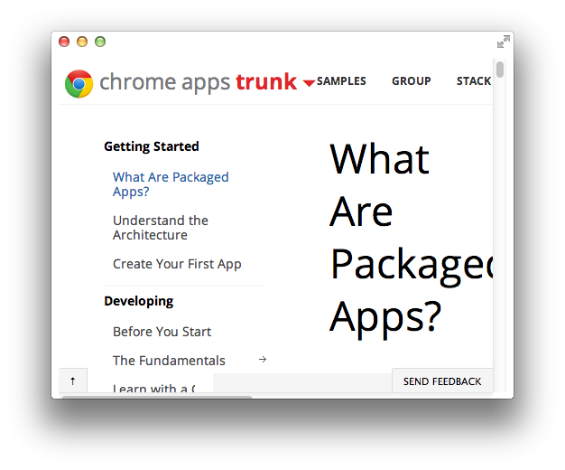
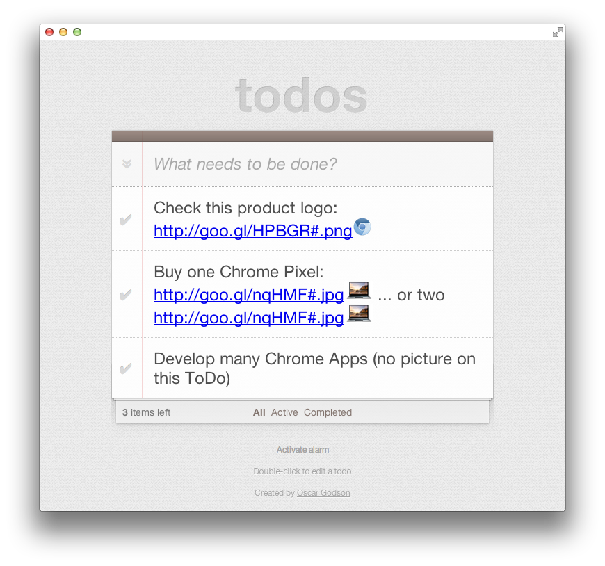
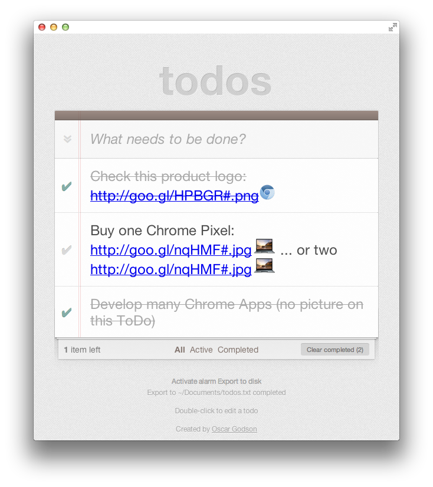

# Chrome packaged apps #
### Codelab at DevFest 2013 Season ###
*translate by: sorcerer.ma@gmail.com*


## 介绍 ##

欢迎来到 chrome 应用 的开发练习！这是一个自学课程(self-paced codelab)，在这里你将完成 chrome 应用 开发的基本练习并学习 API 中的一部分。
你可以在 [官方文档](http://developer.chrome.com/apps/about_apps.html) 中找到本教程中大部分概念的详细描述。之后的每一个练习环节都会包含该练习所用到的 API 文档链接。

在第一章节中你将学习开发 chrome 应用 所需的基本构建部分，以及如何运行和调试你的 chrome 应用。

第二章节中我们引入一个众所周知的开源 web 应用，ToDoMVC，通过移除一些不支持的特性（比如 localStorage）并实现 CSP compliance，来学习如何让该 web 应用成为 chrome 应用。

之后的第三章节，我们会使用 chrome 应用独有的 API 为 ToDoMVC 添加一些功能。

最后，你能够开发出一个具有离线能力、可安装的并功能完善的 ToDoMVC 应用。通过整个学习过程，你会学到：

* chrome 应用(chrome platform)的基础构件以及开发流程
* 如何将已有的 web 应用打包成可在 chrome 平台上运行的应用
* chrome.storage.local storage，一个异步的本地存储
* 提醒和通知的 API
* 如何通过 webview 标签来显示外部的、无限制的网页内容
* 如何从外部来源加载资源文件（如图片）
* 使用扩展的文件系统 API 向本地的文件系统写入文件


## 准备工作 ##

本课程假定你已具备 web 编程的基础知识。你应该已经知道基本 HTML 和 CSS，并且你应该熟悉 javascript。

你应该安装了 Chrome Dev。在 chrome 的地址栏中输入 `chrome://version` 来查看你的 **"Google Chrome" 浏览器的版本为 28** 或者更高。如果不是，请根据此链接的引导操作：[https://www.google.com/intl/en/chrome/browser/index.html?extra=devchannel#eula](https://www.google.com/intl/en/chrome/browser/index.html?extra=devchannel#eula)

**PIXEL 用户**：如果你想使用你那闪亮的 Pixel Chromebook（你应该使用它！），请查看第 1 步中的指导。(just follow the instructions at the beginning of Step 1.)

如果你真的很想使用 Chrome 27，请注意第 3 步中的通知是无法使用的。

## 如何使用本资料 ##

新建一个文件夹。每一步的练习都建立在之前的练习成果之上。每个练习都有一个参考时间，如果你的练习时间超过了参考时间并想进入下一阶段的练习，每一步都会有 “cheat” 链接，通过这个链接你可以获取从上一步相关代码。(from the previous step.)

下载所有的练习代码：[http://goo.gl/KJIihd](http://goo.gl/KJIihd)  
安装并运行本课程的应用: [http://goo.gl/9zCZQM](http://goo.gl/9zCZQM)


## 第 1 步 - 创建并运行一个最小的应用 ##

目标：掌握开发流程  
完成本练习的建议时间：10 分钟

除了你的应用本身所需要的代码，一个 chrome 应用还需要两个文件：

* 一个 [manifest](http://developer.chrome.com/apps/manifest.html)，用来指定你的应用的元信息(meta information)
* 一个 [event page](http://developer.chrome.com/apps/app_lifecycle.html#eventpage)，该文件也叫 background page，通常在此文件中注册指定事件的监听器，如打开应用窗口的启动监听器

> 闪亮的 chromebook 使用指导部分，这部分翻译就交给有 chromebook 的高富帅吧。

打开你最喜爱的 代码/文本 编辑器并在一个空的目录下创建以下文件：

manifest.json:  
```json
{
  "manifest_version": 2,
  "name": "I/O Codelab",
  "version": "1",
  "permissions": [],
  "app": {
    "background": {
      "scripts": ["background.js"]
    }
  },
  "minimum_chrome_version": "28"
}
```

background.js:  
```javascript
chrome.app.runtime.onLaunched.addListener(function() {
  chrome.app.window.create('index.html', {
    id: 'main',
    bounds: { width: 620, height: 500 }
  });
});
```

index.html:  
```html
<!DOCTYPE html>
<html>
<head>
    <meta charset="utf-8">
</head>
<body>
    <h1>Hello, let's code!</h1>
</body>
</html>
```

恭喜，你刚刚已经创建了一个新的 chrome 应用。如果你复制了 cheats 里的代码，确保你也复制了 icon_128.png，因为在 manifest.json 中关联了这个文件。

现在你可以运行它了：



### 如何调试 Chrome 应用 ###

如果你熟悉 Chrome 开发者工具，你就知道你可以使用开发者工具来查看、调试、审计以及测试你的应用，就像你在普通的 web 页面上所做的一样。

通常的开发方式是：

* 写一段代码
* 重新加载应用（右击鼠标，重新加载应用）
* 测试
* 查看开发者工具控制台中是否有错误
* 重复以上部分


开发者工具的控制台具有与你的应用相同的权限来使用你应用中的 API。这样，你就可以在加入一个 API 到你的代码中之前方便的测试它：



## 第 2 步 - 引入 ToDoMVC 应用并使之适应 Chrome(Import and adapt ToDoMVC app) ##

想从这一步重新开始？可以在 solution_for_step1 子目录下找到之前练习的代码！

目标：  
* 学习如何将一个现有的应用适用于 Chrome 应用平台
* 学习 [chrome.storage.local API](http://developer.chrome.com/apps/storage.html)
* 为下一个练习做准备  
完成本练习的建议时间：10 分钟

我们引入一个已有的常见 web 应用到我们的项目，作为练习的开始，我们会使用一个非常主流(benchmark)的应用，ToDoMVC：

1. 我们会引入 ToDoMVC 应用的一个版本(a version of the ToDoMVC app)（[相关代码的压缩包](http://github.com/mangini/io13-codelab/archive/master.zip)）。请复制所有的内容，包括其中的子目录，从压缩包里的 *todomvc* 文件夹到你的应用所在的文件夹。  
完成后你的应用所在的文件夹里应该有一下文件结构：

   ```
     manifest.json（来自第 1 步）  
     background.js（来自第 1 步）  
     icon_128.png（可选，来自第 1 步）  
     index.html（来自 todomvc）  
     bower.json（来自 todomvc）  
     bower_components/（来自 todomvc）  
     js/（来自 todomvc）  
   ```

2. 现在重新加载你的应用。你应该可以看到基本的界面，但没有什么东西可以工作(but nothing else will work)。如果你打开控制台（右击，审查元素，控制台），你会发现这样的错误：
> Refused to execute inline script because it violates the following Content Security Policy directive: "default-src 'self' chrome-extension-resource:". Note that 'script-src' was not explicitly set, so 'default-src' is used as a fallback.
index.html:42

### CSP Compliance ###

1. 让我们通过创建应用的 [CSP compliant](http://developer.chrome.com/apps/contentSecurityPolicy.html) 来修复这个错误。引起 CSP non-compliances 的一个常见原因是内联的 Javascript，比如 DOM 属性上的事件处理（`<button onclick=''>`）以及 HTML 中的 `<script>` 标签。解决此问题的方法很简单：只要把那些内联的内容移动到新的文件中：
    * a. 编辑 `index.html` 并把内联的 Javascript 移动到一个新文件 `js/bootstrap.js`:  
    ```html
    <!--
    <script>
        // Bootstrap app data
        window.app = {}; 
    </script>
    -->
    <script src="js/bootstrap.js"></script>
    ```
    * b. 创建 `js/bootstrap.js`，内容为：
    ```javascript
    // Bootstrap app data
    window.app = {};
    ```
3. 重新加载你的应用，是不是仍然报错？只是之前的错误已经不见了，但有了另一个错误：
> Uncaught window.localStorage is not available in packaged apps. Use chrome.storage.local instead. platformApp:16
4. 这个错误需要更多的步骤来修复


### 把 localStorage 变为 chrome.storage.local ###

Chrome 应用不支持 LocalStorage。为什么呢？因为 LocalStorage 是同步的，而同步获取的块资源（I/O）方式在单线程的运行环境中通常不是一个好办法。如果你的存储有着很高的延迟，那你的应用可能变得无响应。

Chrome 应用拥有一个等价的异步存储来直接存放对象，避免了某些时候 *对象 -> 字符串 -> 对象* 的序列化过程所造成的代价。

为了修复刚才的问题，我们需要将 localStorage 转换为 chrome.storage.local。这需要许多步骤，不过这些步骤对于 API 调用和修复 ToDoMVC 异步支持的改动都很小(but they are all small changes to the API calls or fixes on the ToDoMVC async support)。

**注意**：修改 ToDoMVC 中所有用到 localStorage 的地方是很耗时的而且容易出错，尽管这对于你的学习很必要。为了最大化你学习的乐趣，我们非常建议你：  
* a. 看一下下方代码的改动。确认你是否能够理解它们，如果有问题请询问助教。  
* b. **复制 cheat_code/solution_for_step_2 下的文件并进入下一步练习**。我们已经搞定了下面的步骤，以便你继续学习。( We've kept all the steps below for learning purposes)

1. 在 `manifest.json` 中，加入 "storage" 权限：
   
   ```json
   ···
     "permissions": ["storage"],
   ···
   ```

2. 在 `store.js` 中，修复构造器：

   ```javascript
   function Store(name, callback) {
     var data;
     var dbName;
   
     callback = callback || function() {};
   
     dbName = this._dbName = name;
   
     /* if (!localStorage[dbName]) {
       data = {
         todos: []
       };
       localStorage[dbName] = JSON.stringify(data);
     }
   
     callback.call(this, JSON.parse(localStorage[dbName])); */
   
     chrome.storage.local.get(dbName, function(storage) {
       if ( dbName in storage ) {
         callback.call(this, storage[dbName].todos);
       } else {
         storage = {};
         storage[dbName] = { todos: [] };
         chrome.storage.local.set( storage, function() {
           callback.call(this, storage[dbName].todos);
         }.bind(this));
       }
     }.bind(this));
   
   }
   ```

3. 修复 find 方法：

   ```
   Store.prototype.find = function (query, callback) {
     if (!callback) {
       return;
     }

     /* var todos = JSON.parse(localStorage[this._dbName]).todos;

     callback.call(this, todos.filter(function (todo) {
       for (var q in query) {
         return query[q] === todo[q];
       }
     })); */

     chrome.storage.local.get(this._dbName, function(storage) {
       var todos = storage[this._dbName].todos.filter(
         function (todo) {
           for (var q in query) {
             return query[q] === todo[q];
           }
         });
       callback.call(this, todos);
     }.bind(this));
   };
   ```

4. 修复 findAll 方法：

   ```
   Store.prototype.findAll = function (callback) {
     callback = callback || function () {};
     /* callback.call(this, JSON.parse(localStorage[this._dbName]).todos); */
   
     chrome.storage.local.get(this._dbName, function(storage) {
       callback.call(this, storage[this._dbName].todos);
     }.bind(this));
   };
   ```

5. save 方法提出了新的挑战：因为它依赖了两个异步操作（get 和 set），这两个操作每次都会操作整个 JSON 存储，在对一个以上的 ToDos 进行任何一种批量操作都会造成称之为 [Read-After-Write](http://en.wikipedia.org/wiki/Hazard_(computer_architecture)#Read_After_Write_.28RAW.29) 的数据冒险(数据冲突)。有一些办法可以解决这个问题，但是我们会利用之后的机会来稍稍重构它(代码)，通过使用一个含有 ToDo id 的数组来进行单次更新。请注意如果我们使用像索引数据库这样的更加合适的数据存储，就不会发生这样的问题了。不过我们正在努力减少转换工作(minimize the conversion effort)：

   ```
   Store.prototype.save = function (id, updateData, callback) {

     chrome.storage.local.get(this._dbName, function(storage) {

       /* var data = JSON.parse(localStorage[this._dbName]); */
       var data = storage[this._dbName];

       var todos = data.todos;
       
       callback = callback || function () {};
       
       // If an ID was actually given, find the item and update each property
       if ( typeof id !== 'object'  || Array.isArray(id) ) {
         var ids = [].concat( id );
         ids.forEach(function(id) {
           for (var i = 0; i < todos.length; i++) {
             if (todos[i].id == id) {
               for (var x in updateData) {
                 todos[i][x] = updateData[x];
               }
             }
           }
         });

         /* localStorage[this._dbName] = JSON.stringify(data);
         callback.call(this, JSON.parse(localStorage[this._dbName]).todos); */
         chrome.storage.local.set(storage, function() {
           chrome.storage.local.get(this._dbName, function(storage) {
             callback.call(this, storage[this._dbName].todos);
           }.bind(this));
         }.bind(this));

       } else {
         callback = updateData;
         
         updateData = id;
         
         // Generate an ID
         updateData.id = new Date().getTime();
         
         todos.push(updateData);
         /* localStorage[this._dbName] = JSON.stringify(data);
         callback.call(this, [updateData]); */

         chrome.storage.local.set(storage, function() {
           callback.call(this, [updateData]);
         }.bind(this));

       }
     }.bind(this));
   };
   ```
6. 我们也需要改写客户端的 save 方法，使它能够在一次调用中包含所有的 ID。(it can include all IDs in one call)

   * a. `controller.js` 中 toggleComplete 的 update 方法：

     ```
     Controller.prototype.toggleComplete = function (ids, checkbox, silent) {
       var completed = checkbox.checked ? 1 : 0;

       this.model.update(ids, { completed: completed }, function () {
         if ( ids.constructor != Array ) {
           ids = [ ids ];
         }

         ids.forEach( function(id) {

           var listItem = $$('[data-id="' + id + '"]');
           
           if (!listItem) {
             return;
           }

           listItem.className = completed ? 'completed' : '';
           
           // In case it was toggled from an event and not by clicking the checkbox
           listItem.querySelector('input').checked = completed;
         });

         if (!silent) {
           this._filter();
         }
       }.bind(this));
     };
     ```

   * b. `controller.js` 中 toggleAll 的 update 方法：

     ```
     Controller.prototype.toggleAll = function (e) {
       var completed = e.target.checked ? 1 : 0;
       var query = 0;

       if (completed === 0) {
         query = 1;
       }

       this.model.read({ completed: query }, function (data) {
         var ids = [];
         data.forEach(function (item) {
           ids.push(item.id);
           /* this.toggleComplete(item.id, e.target, true); */
         }.bind(this));
         this.toggleComplete(ids, e.target, false);
       }.bind(this));
       
       this._filter();
     };
     ```
7. 现在让我们来修复 ToDoMVC 代码中的两个小 bug，当使用异步存储时它们就会出现：

   * c. 在 `controller.js` 中的 removeItem 方法，把调用 _filter 的语句移动到回调函数里：

     ```
     Controller.prototype.removeItem = function (id) {
       this.model.remove(id, function () {
         this.$todoList.removeChild($$('[data-id="' + id + '"]'));
         this._filter();
       }.bind(this));

       /* this._filter(); */
     };
     ```

   * d. 还是在 `controller.js` 中，使 _updateCount 变为异步执行：

     ```
     Controller.prototype._updateCount = function () {
       /* var todos = this.model.getCount(); *.
       this.model.getCount(function(todos) {

         this.$todoItemCounter.innerHTML = this.view.itemCounter(todos.active);
         
         this.$clearCompleted.innerHTML = this.view.clearCompletedButton(todos.completed);
         this.$clearCompleted.style.display = todos.completed > 0 ? 'block' : 'none';
         
         this.$toggleAll.checked = todos.completed === todos.total;
         
         this._toggleFrame(todos);
       }.bind(this));
     };
     ```

   * e. 现在 `model.js` 中对应的 getCount 方法需要接受回调函数：

     ```
     Model.prototype.getCount = function (callback) {
       var todos = {
         active: 0,
         completed: 0,
         total: 0
       };

       this.storage.findAll(function (data) {
         data.each(function (todo) {
           if (todo.completed === 1) {
             todos.completed++;
           } else {
             todos.active++;
           }

           todos.total++;
         });
         if (callback) callback(todos);
       });
       
       /* return todos; */
     };
     ```

8. 我们快要完成了。如果现在重新加载应用，你能够插入新的 Todo 了，但是你还不能移除它们。现在让我们来修复 `store.js` 中的 remove 方法。同样，之前在 save 方法中提到的数据冒险(数据冲突)问题也存在于这里，因此我们需要改写 remove 方法使其允许批量操作：

   * f. 修复 `store.js` 中的 remove 方法：

     ```
     Store.prototype.remove = function (id, callback) {
       chrome.storage.local.get(this._dbName, function(storage) {
         /* var data = JSON.parse(localStorage[this._dbName]); */
         var data = storage[this._dbName];
         var todos = data.todos;

         var ids = [].concat(id);
         ids.forEach( function(id) {
           for (var i = 0; i < todos.length; i++) {
             if (todos[i].id == id) {
               todos.splice(i, 1);
               break;
             }
           }
         });

       /* localStorage[this._dbName] = JSON.stringify(data);
       callback.call(this, JSON.parse(localStorage[this._dbName]).todos); */
         chrome.storage.local.set(storage, function() {
           callback.call(this, todos);
         }.bind(this));
       }.bind(this));
     };
     ```

   * g. 现在改写 `controller.js` 中的 removeCompletedItems 使其对所有的 id 调用一次 removeItem：

     ```
     Controller.prototype.removeCompletedItems = function () {
       this.model.read({ completed: 1 }, function (data) {
         var ids = [];
         data.forEach(function (item) {
           ids.push(item.id);
           /* this.removeItem(item.id); */
         }.bind(this));
         this.removeItem(ids);
       }.bind(this));

       this._filter();
     };
     ```

   * h. 最后改写 `controller.js` 中的 removeItem 以支持一次性从 DOM 移除多个条目：

     ```
     Controller.prototype.removeItem = function (id) {
       this.model.remove(id, function () {
         var ids = [].concat(id);
         ids.forEach( function(id) {
           this.$todoList.removeChild($$('[data-id="' + id + '"]'));
         }.bind(this));
         this._filter();
       }.bind(this));
     };
     ```

9. 完成了！重新加载你的应用（右击，重新加载应用），好好享受吧！

其实 `store.js` 中还有另一个方法使用了 localStorage：drop。但因为整个项目都没有用到它，所以我们决定让你之后修复它来作为练习。

现在你应该拥有了如下面截图一样的一个酷炫的 Chrome 打包版 ToDoMVC：



### 遇到问题了？ ###

记住保持开发者工具的控制台处于打开状态，观察 Javascript 的错误信息：

* 打开开发者工具（应用窗口内右击，点击查看元素）
* 选择 Console 标签
* 你可以在其中看到运行时的错误信息


## 第 3 步 - 提醒和通知：提醒你打开 To Do's ##

想从这一步重新开始？可以在 solution_for_step2 子目录下找到之前练习的代码！

目标：  
* 学习如何用提醒功能指定一个间隔时间来唤醒你的应用
* 学习如何使用通知功能来提示用户一些重要的信息(something important)
完成本练习的建议时间：20 分钟

现在我们要改写这个应用，让它能够在需要你打开 To Do's 的时候提醒你，即使在应用关闭的时候。应用将会使用 [Alarm API](http://developer.chrome.com/apps/alarms.html) 来设置一个唤醒应用的间隔时间，只要 Chrome 一直在运行，提醒监听器就会在接近于所设置的间隔时间被调用。

### Part 1 - 提醒 ###

1. 在 `manifest.json` 文件中，加入 "alarms" 权限：

   ```json
   ···
   "permissions": ["storage", "alarms"],
   ···
   ```

2. 在 `background.js` 中，加入 onAlarm 监听器，目前，每当 storage 中有一个 To Do 的项目时向控制台发送一个 log 消息即可：

   ```javascript
   ···
   chrome.app.runtime.onLaunched.addListener(function() {
     chrome.app.window.create(index.html', {
       id: 'main',
       bounds: { width: 620, height: 500 }
     });
   });

   chrome.alarms.onAlarm.addListener(function( alarm ) {
     console.log("Got an alarm!", alarm);
   });
   ```

3. 在 `index.html` 中，添加一个 "Activate alarm" 按钮并引入我们之后要创建的脚本：

   ```html
   ···
     <footer id="info">
       <button id="toggleAlarm">Activate alarm</button>
       <p>Double-click to edit a todo</p>
   ···
     <script src="js/store.js"></script>
     <script src="js/model.js"></script>
     <script src="js/view.js"></script>
     <script src="js/controller.js"></script>
     <script src="js/app.js"></script>
     <script src="js/alarms.js"></script>
   </body>
   </html>
   ``` 

4. 创建一个新的脚本 js/alarms.js：

   * 添加 checkAlarm, createAlarm, cancelAlarm 和 toggleAlarm 方法：

   ```javascript
   (function () {
     'use strict';
     var alarmName = 'remindme'; 
     
     function checkAlarm(callback) {
       chrome.alarms.getAll(function(alarms) { 
         
         var hasAlarm = alarms.some(function(a) {
           return a.name == alarmName;
         });
         
         var newLabel;
         if (hasAlarm) {
           newLabel = 'Cancel alarm';
         } else {
           newLabel = 'Activate alarm';
         }
         document.getElementById('toggleAlarm').innerText = newLabel;
         
         if (callback) callback(hasAlarm);
       })
     }

     function createAlarm() {
       chrome.alarms.create(alarmName, {
         delayInMinutes: 0.1, periodInMinutes: 0.1});
     }

     function cancelAlarm() {
       chrome.alarms.clear(alarmName);
     }

     function doToggleAlarm() {
       checkAlarm( function(hasAlarm) {
         if (hasAlarm) {
           cancelAlarm();
         } else {
           createAlarm();
         }
         checkAlarm();
       });
     }

     $$('#toggleAlarm').addEventListener('click', doToggleAlarm);
     checkAlarm();
   })();
   ```

   ### 注意： ###

   * 观察调用 chrome.alarms.create 时的参数，这些非常小的值（0.1 of a minute） 只是为了用来测试。在发布的应用中，这些值不会被接受，它们会被四舍五入到接近 1 分钟。在你的测试环境中，一个简单的警告被发送到了控制台 - 你可以忽略它。
       打开开发者工具（在应用窗口上右击，点击**检查背景页**，选择控制台标签）。每当你激活了一个提醒，你应该会在控制台里看到日志信息 "rings" 被显示出来。

### part 2 - 通知 ###

现在让我们把提醒通知变成能让用户更容易注意到的东西。为了达到这个目的，我们要使用 [chrome notifications API](http://developer.chrome.com/apps/desktop_notifications.html)。我们将显示一个像下面这样桌面通知，并且当用户点击通知后，弹出 To Do 窗口到最上层。(to the top)



1. 在 `manifest.json` 中，加入 "notifications" 权限：

   ```
   ···
   "permissions": ["storage", "alarms", "notifications"],
   ···
   ```

2. 在 `background.js` 中：
   * 把 chrome.app.window.create 的调用移动到一个方法中，为了让我们可以重用它：

     ```javascript
     ...
     function launch() {
      chrome.app.window.create('index.html', {
        id: 'main',
        bounds: { width: 620, height: 500 }
      });
     }

     /*
     chrome.app.runtime.onLaunched.addListener(function() {
       chrome.app.window.create('index.html', {
         id: 'main',
         bounds: { width: 620, height: 500 }
       });
     });
     */

     chrome.app.runtime.onLaunched.addListener(launch);
     ...
     ```

   * 创建一个 showNotification 方法（注意下面的样例代码关联了 icon_128.png。如果你希望你的通知拥有一个图标，记得也把图标从作弊代码(TODO: cheat code)复制过来或创建一个你自己的图标）：
   
     ```javascript
     ...
     var dbName = 'todos-vanillajs';

     function showNotification(storedData) {

       var openTodos = 0;
       
       if ( storedData[dbName].todos ) {
         storedData[dbName].todos.forEach(function(todo) {
           if ( !todo.completed ) {
             openTodos++;
           }
         });
       }
       
       if (openTodos>0) {
         // Now create the notification
         chrome.notifications.create('reminder', {
             type: 'basic',
             iconUrl: 'icon_128.png',
             title: 'Don\'t forget!',
             message: 'You have '+openTodos+
                      ' things to do. Wake up, dude!'
          }, function(notificationId) {})
       }
     }

     // When the user clicks on the notification,
     // we will open the To Do list and dismiss the notification
     chrome.notifications.onClicked.addListener(
       function( notificationId ) {
         launch();
         chrome.notifications.clear(notificationId, function() {});
       }
     );
     ...
     ```

   * 改写 onAlarm 监听器，把向控制台输出简单的新提醒信息变成存储数据并调用 showNotification：

     ```  
     ...
     chrome.alarms.onAlarm.addListener(function( alarm ) {
      /* console.log("Got an alarm!", alarm); */
      chrome.storage.local.get(dbName, showNotification);
     });
     ...
     ```

现在重启你的应用并花一些使用它。你会注意到：

* 即使你关闭了应用的窗口，提醒还是会出现
* 如果你关闭了所有 Chrome 窗口，提醒就不会出现（非 ChromeOS 平台）
* 当你的应用关闭后，你点击通知会打开应用窗口

### 遇到问题了？ ###

如果通知没有显示，检查一下你的 Chrome 版本是不是 28 或更高。chrome 通知是 Chrome 28 引进的，所以你可能想要使用标准的 web 通知 API，我们把改写代码的挑战留个你。W3C 的规范在[这里](http://www.w3.org/TR/notifications/)。

如果你的 Chrome 是 28 但是通知还是没有显示，检查控制台中主窗口（右击 -> 审查元素）和背景页（右击 -> 审查背景页）的错误信息


## 第 4 步 - 解析 URL 并在 Webview 中打开 ##

想从这一步重新开始？可以在 solution_for_step3 子目录下找到之前练习的代码！

目标：
* 学习在安全的沙箱模式下通过 [webview 标签](http://developer.chrome.com/apps/tags/webview.html) 在你的应用中加载并显示大部分的外部内容。 // TODO
完成本练习的建议时间：10 分钟

一些应用需要直接向用户展示一些外部的 web 内容，同时保持用户在应用的体验内(TODO: but keep him inside the application experience)。举例来说，一个新闻汇集应用(TODO: a news aggregator)可能想要从外部站点嵌入各种新闻且希望与原网站的格式、图片和行为保持一致。为完成这一点或其他用途，Chrome 打包应用拥有一个叫做 [webview](http://developer.chrome.com/apps/tags/webview.html) 的自定义的标签。它是一个非常强大的组建，但其最基础的用法事实上是非常简单的，你接下来将会学习它。

我们现在要改写我们的例子让其能够在 ToDo 内容中搜索网址，当找到搜索结果时添加一个链接。当点击该链接时将用一个 webview 打开一个新的应用窗口（不是浏览器标签）来展示内容。

1. 在 `manifest.json` 中，加入 "webview" 权限：
   ```json
   ···
     "permissions": ["storage", "alarms", "notifications", "webview"],
   ···
   ```

2. 使用一个简单的 `<webview>` 标签创建一个新文件 `webview.html`：
   ```html  
   <!DOCTYPE html>
   <html>
   <head>
     <meta charset="utf-8">
   </head>
   <body>
     <webview style="width: 100%; height: 100%;"></webview>
   </body>
   </html>
   ```

3. 在 `controller.js` 中：
   
   * 添加一个方法用来解析 To Do 内容中的链接地址。一旦找到地址，用一个锚点来替换它：
     ```javascript
     Controller.prototype._parseForURLs = function (text) {
       var re = /(https?:\/\/[^\s"<>,]+)/g;
       return text.replace(re, '<a href="$1" data-src="$1">$1</a>');
     };
    ```

   * 添加一个方法来打开一个带有 webview 的新窗口并给 webview.src 设置一个地址：
     ```javascript
     Controller.prototype._doShowUrl = function(e) {
       // only applies to elements with data-src attributes
       if (!e.target.hasAttribute('data-src')) {
         return;
       }
       e.preventDefault();

       var url = e.target.getAttribute('data-src');
       chrome.app.window.create(
        'webview.html',
        {hidden: true},   // only show window when webview is      configured
        function(appWin) {
          appWin.contentWindow.addEventListener('DOMContentLoaded',
            function(e) {
              // when window is loaded, set webview source
              var webview = appWin.contentWindow.
                   document.querySelector('webview');
              webview.src = url;
              // now we can show it:
              appWin.show();
            }
          );
        });
     };
     ```

   * 每当显示代办项(TODO: items)的时候进行链接解析：
     ```javascript
     /**
      * An event to fire on load. Will get all items and display them in the
      * todo-list
      */
     Controller.prototype.showAll = function () {
       this.model.read(function (data) {
         this.$todoList.innerHTML =
            this._parseForURLs(this.view.show(data));
       }.bind(this));
     };

     /**
      * Renders all active tasks
      */
     Controller.prototype.showActive = function () {
       this.model.read({ completed: 0 }, function (data) {
         this.$todoList.innerHTML =
            this._parseForURLs(this.view.show(data));
       }.bind(this));
     };

     /**
      * Renders all completed tasks
      */
     Controller.prototype.showCompleted = function () {
       this.model.read({ completed: 1 }, function (data) {
         this.$todoList.innerHTML =
             this._parseForURLs(this.view.show(data));
       }.bind(this));
     };
     ```

   * 解析编辑项中的链接。同样的，修复代码让其使用 input 元素的 innerText 来代替它的 innerHTML：
     ```javascript
     Controller.prototype.editItem = function (id, label) {
       ...

       var onSaveHandler = function () {
         ...
           // Instead of re-rendering the whole view just update
           // this piece of it
           /* label.innerHTML = value; */
           label.innerHTML = this._parseForURLs(value);

       ...

       // Get the innerHTML of the label instead of requesting the data from the
       // ORM. If this were a real DB this would save a lot of time and would avoid
       // a spinner gif.
       /* input.value = label.innerHTML; */
       input.value = label.innerText;
       ...
     ```

   * 最后，在 Controller 构造器中添加一个点击事件监听器，当用户点击链接时调用 doShowUrl 方法：
     ```javascript
     function Controller(model, view) {
       this.model = model;
       this.view = view;

       this.ENTER_KEY = 13;
       this.ESCAPE_KEY = 27;

       this.$main = $$('#main');
       this.$toggleAll = $$('#toggle-all');
       this.$todoList = $$('#todo-list');
       this.$todoItemCounter = $$('#todo-count');
       this.$clearCompleted = $$('#clear-completed');
       this.$footer = $$('#footer');
       
       this.router = new Router();
       this.router.init();
       
       this.$todoList.addEventListener('click', this._doShowUrl);
       ...
     ```

现在，如果你重载你的应用，你看到的应该如下图：



点击链接后：



**注意**：一个 webview 就是一个沙箱进程。你只能通过使用其 [API](http://developer.chrome.com/apps/tags/webview.html) 与其交互。嵌入的应用（你的应用）无法简单的获取直接访问 webview 的权限，如示例(TODO: for example)。

**高级**：如果你提前完成了，浏览一下 [webview]() 的文档并运行其中一些方法，让 webview 在加载时显示一个小的状态信息或状态指示器。


## 第 5 步 - 从 web 添加图片 ##

想从这一步重新开始？可以在 solution_for_step4 子目录下找到之前练习的代码！

目标：
* 学习如何通过 XHR 和 ObjectURLs 加载你的应用的外部资源并添加到 DOM 中。
完成本练习的建议时间：20 分钟

Chrome 打包应用平台要求你的应用必须完全遵从内容安全政策。其中包括不能够直接加载 DOM 资源，如那些在你应用外部的图片、字体和 CSS。如果你想要在你的应用中显示一张外部图片，你需要通过 XHR 来请求，将它放进一个 Blob(TODO: Blob 怎么翻译 = =)并创建一个 ObjectURL。该 ObjectURL 之后能够被添加进 DOM，因为它与应用的上下文中的一个内存项相关(TODO: it refers to an in-memory item in the context of the app)。

让我们改写我们的应用来查找 To Do 内容中的图片链接。如果地址看上去像一个图片（以 .png, .jpg, .svg 或 .gif 结尾），我们会下载该图片并将其作为缩略图放在锚点中显示在一侧。

1. 在 `manifest.json` 中，加入 "<all_url>" 权限。在一个 Chrome 打包应用中你可以让 XMLRequest 请求发向任意地址，只要你在 manifest 中把该域名设为白名单。我们不设置指定的域名，而是要求开启访问 "<all_urls>"（所有地址）的权限，是因为我们无法提前知道使用我们应用的用户将会在 To Do 的内容中输入什么图片地址：

   ```json
   ···
     "permissions": ["storage", "alarms",
                     "notifications", "webview", "<all_urls>"],
   ···
   ```

2. 在 `js/controller.js` 中：
   
   a. 添加一个方法来从 Blob(TODO: 怎么翻译？) 创建 ObjectURLs。ObjectURLs 会保持在内存中，在你不需要它们时需释放它们，所以也要增加一个 clear 方法：

      ```javascript
      Controller.prototype._clearObjectURL = function() {
        if (this.objectURLs) {
          this.objectURLs.forEach(function(objURL) {
            URL.revokeObjectURL(objURL);
          });
          this.objectURLs = null;
        }
      };

      Controller.prototype._createObjectURL = function(blob) {
        var objURL = URL.createObjectURL(blob);
        this.objectURLs = this.objectURLs || [];
        this.objectURLs.push(objURL);
        return objURL;
      };
      ```

   b. 添加一个方法来执行 XMLRequest 的 URL(TODO: execute a XMLHttpRequest on a URL)，根据 XHR 的 response 创建一个 ObjectURLs 并用该 ObjectURLs 创建一个  元素添加到 DOM 中：

      ```javascript
      Controller.prototype._requestRemoteImageAndAppend =
        function(imageUrl, element) {
          var xhr = new XMLHttpRequest();
          xhr.open('GET', imageUrl);
          xhr.responseType = 'blob';
          xhr.onload = function() {
            var img = document.createElement('img');
            img.setAttribute('data-src', imageUrl);
            img.className = 'icon';
            var objURL = this._createObjectURL(xhr.response);
            img.setAttribute('src', objURL);
            element.appendChild(img);
          }.bind(this);
          xhr.send();
        };
      ```

   c. 现在添加一个方法，用来找到所有未处理的链接并检查它们。对于每个看上去像图片的链接地址，执行 _requestRemoteImageAndAppend：

      ```javascript
      Controller.prototype._parseForImageURLs = function () {
        // remove old blobs to avoid memory leak:
        this._clearObjectURL();

        var links = this.$todoList.
                    querySelectorAll('a[data-src]:not(.thumbnail)');
        var re = /\.(png|jpg|jpeg|svg|gif)$/;

        for (var i = 0; i<links.length; i++) {
          var url = links[i].getAttribute('data-src');
          if (re.test(url)) {
            links[i].classList.add('thumbnail');
            this._requestRemoteImageAndAppend(url, links[i]);
          }
        }
      };
      ```

   d. 在 showAll、showActive、showCompleted 和 eidtItem 中合适(TODO: appropriately)的地方调用它：

      ```javascript
      Controller.prototype.showAll = function () {
        this.model.read(function (data) {
          this.$todoList.innerHTML =
            this._parseForURLs(this.view.show(data));
          this._parseForImageURLs();
        }.bind(this));
      };

      /**
       * Renders all active tasks
       */
      Controller.prototype.showActive = function () {
        this.model.read({ completed: 0 }, function (data) {
          this.$todoList.innerHTML =
            this._parseForURLs(this.view.show(data));
          this._parseForImageURLs();
        }.bind(this));
      };

      /**
       * Renders all completed tasks
       */
      Controller.prototype.showCompleted = function () {
        this.model.read({ completed: 1 }, function (data) {
          this.$todoList.innerHTML =
            this._parseForURLs(this.view.show(data));
          this._parseForImageURLs();
        }.bind(this));
      };

      ...
      
      Controller.prototype.editItem = function (id, label) {
        var li =  label;

        // This finds the <label>'s parent <li>
        while (li.nodeName !== 'LI') {
          li = li.parentNode;
        }
        
        var onSaveHandler = function () {
          var value = input.value.trim();
          var discarding = input.dataset.discard;
          
          if (value.length && !discarding) {
            this.model.update(id, { title: input.value });
            
            // Instead of re-rendering the whole view just update
            // this piece of it
            label.innerHTML = this._parseForURLs(value);
            this._parseForImageURLs();
      ...
      ```

3. 最后，在 `bower_components/todomvc-common/base.css` 中，添加一条 CSS 规则来限制图片的尺寸：

   ```css
   .thumbnail img[data-src] {
     max-width: 100px;
     max-height: 28px;
   }
   ```

现在重新加载你的应用，打开 Google 图片搜索，找一些图片链接地址并把它们添加到 ToDo 的内容中。一些例子：

[http://goo.gl/lftY4r#.jpg](http://goo.gl/lftY4r#.jpg)  
[http://goo.gl/YCBJz1#.png](http://goo.gl/YCBJz1#.png)

然后看起来会是这样：



**提示**：在真实环境的情况下，当你需要控制离线缓存并同时下载多个资源时，我们创建了一个 [帮助库](https://github.com/GoogleChrome/apps-resource-loader#readme) 来处理一些常见用例。


## 第 6 步 - 导出 ToDo 到文件系统 ##

想从这一步重新开始？可以在 solution_for_step5 子目录下找到之前练习的代码！

目标：
* 学习如何获取外部文件系统中的文件的引用，并使用 [FileSystem API](http://developer.chrome.com/apps/app_storage.html#filesystem) 在应用的生命周期中写入该文件。
完成本练习的建议时间：20 分钟

在这一步中，我们将在应用里添加一个导出按钮。点击后，当前的 To Do 项会保存到一个用户选择的文本文件中。如果文件存在，则会替换此文件。否则，会创建一个新文件。值得注意的是在表示文件实体的对象的生命周期内，用户仅需要选择文件一次。在我们的例子中，我们把它绑定到应用窗口上 - 因此只要用户保持窗口打开，Javascript 代码就能无需任何用户交互来写入选择的文件。

1. 在 `manifest.json` 中，添加 `{fileSystem: [ "write" ] }` 授权。注意该授权的语法要比其他的更复杂，我们不仅需要获取外部文件系统，也需要向其写入：

   ```
   ...
     "permissions": ["storage", "alarms", "notifications", "webview",
                     "<all_urls>", { "fileSystem": ["write"] } ],
   ...
   ```

2. 在 `index.html` 中，添加一个 "导出到磁盘" 按钮以及一个 div，用来让我们显示状态信息。另外，加载我们之后会创建的脚本：

   ```html
   ...
     <footer id="info">
       <button id="toggleAlarm">Activate alarm</button>
       <button id="exportToDisk">Export to disk</button>
       <div id="status"></div>
       <p>Double-click to edit a todo</p>
       <p>Created by <a href="http://twitter.com/oscargodson">Oscar Godson</a></p>
     </footer>
     <script src="bower_components/todomvc-common/base.js"></script>
     <script src="bower_components/director/build/director.js"></script>
     <script src="js/bootstrap.js"></script>
     <script src="js/helpers.js"></script>
     <script src="js/store.js"></script>
     <script src="js/model.js"></script>
     <script src="js/view.js"></script>
     <script src="js/controller.js"></script>
     <script src="js/app.js"></script>
     <script src="js/alarms.js"></script>
     <script src="js/export.js"></script>
   </body>
   </html>
   ```

3. 按照以下步骤创建一个新 Javascript 脚本，`js/export.js`：

   * 一个 getTodosAsText 方法用来从 chrome.storage.local 读取 ToDos 并生成相应的文本内容；
   * 一个 exportToFileEntry 方法，给定一个文件实体，会保存 To Do 的文本到那个文件；
   * 一个 doExportToDisk 方法，在我们已有一个保存过的文件实体时，执行上面添加的 exportToFileEntry 方法，在没有的时候让用户选择一个；
   * 监听 "导出到磁盘" 按钮的点击事件

   ```javascript
   (function() {

     var dbName = 'todos-vanillajs';
     
     var savedFileEntry, fileDisplayPath;
     
     function getTodosAsText(callback) {
       chrome.storage.local.get(dbName, function(storedData) {
         var text = '';
         
         if ( storedData[dbName].todos ) {
           storedData[dbName].todos.forEach(function(todo) {
               text += '- ';
               if ( todo.completed ) {
                 text += '[DONE] ';
               }
               text += todo.title;
               text += '\n';
             }, '');
         }
         
         callback(text);
       
       }.bind(this));
     }

     // Given a FileEntry,
     function exportToFileEntry(fileEntry) {
       savedFileEntry = fileEntry;

       var status = document.getElementById('status');
       
       // Use this to get a pretty name appropriate for displaying
       chrome.fileSystem.getDisplayPath(fileEntry, function(path) {
         fileDisplayPath = path;
         status.innerText = 'Exporting to '+path;
       });
       
       getTodosAsText( function(contents) {
         
         fileEntry.createWriter(function(fileWriter) {
           
           fileWriter.onwriteend = function(e) {
             status.innerText = 'Export to '+
                  fileDisplayPath+' completed';
           };
           
           fileWriter.onerror = function(e) {
             status.innerText = 'Export failed: '+e.toString();
           };
           
           var blob = new Blob([contents]);
           fileWriter.write(blob);
           
           // You need to explicitly set the file size to truncate
           // any content that might was there before
           fileWriter.truncate(blob.size);
         
         });
       });

     }

     function doExportToDisk() {
       
       if (savedFileEntry) {
         
         exportToFileEntry(savedFileEntry);
       
       } else {
         
         chrome.fileSystem.chooseEntry( {
           type: 'saveFile',
           suggestedName: 'todos.txt',
           accepts: [ { description: 'Text files (*.txt)',
                        extensions: ['txt']} ],
           acceptsAllTypes: true
         }, exportToFileEntry);
       
       }
     }

    document.getElementById('exportToDisk').
      addEventListener('click', doExportToDisk);
   
   })()
   ```

**高级**：文件实体无法持久化，这意味着每次启动你的应用都需要让用户选择文件。但是，如果你的应用被强制重启（比如运行环境崩溃、应用升级或运行环境升级），那么 [这里有一个选项](http://developer.chrome.com/apps/fileSystem.html#method-restoreEntry) 来还原文件实体。如果你提前完成，尝试一下保存 [retainEntry](http://developer.chrome.com/apps/fileSystem.html#method-retainEntry) 返回的 ID 并且在应用重启时恢复它（提示：为 背景页的 onRestarted 事件添加一个监听器）

恭喜你！如果你完成了所有的步骤，你应该有了一个如下图所示的完整的 ToDoMVC 打包应用：




## 进阶的奖励挑战：添加语音指令 ##

想从这一步重新开始？可以在 solution_for_step6 子目录下找到之前练习的代码！

如果你已经进行到这一步并且还有多余的时间，你可能会想要尝试一下非常高级的挑战：让你的应用能够通过说话来添加 ToDos，这个怎么样？使用 [HTML 5 WebSpeech API](http://www.google.com/intl/en/chrome/demos/speech.html) 并按照以下高阶步骤(TODO: high-level step)来做：

* 在 `manifest.json` 中添加 "audioCapture" 授权
* 当用户点击激活按钮时开始语音识别
* 在 "add note" 命令之后、"end note" 之前，获取任意文本并保存它们到 To Do 项中

这部分挑战没有作弊用的代码，自己来 hack 吧！

----------------------

[1] http://developer.chrome.com/trunk/apps/manifest.html
[2] http://developer.chrome.com/trunk/apps/app_lifecycle.html#eventpage
[3] http://goo.gl/u9sRAL
[4] http://developer.chrome.com/trunk/apps/storage.html
[5] If you know the ToDoMVC web app (http://todomvc.com), we have copied its vanilla JavaScript version to be used as a starting point.
[6] http://developer.chrome.com/trunk/apps/app_csp.html
[7] http://en.wikipedia.org/wiki/Hazard_(computer_architecture)#Read_After_Write_.28RAW.29
[8] http://www.w3.org/TR/notifications/
[9] http://developer.chrome.com/trunk/apps/webview_tag.html
[10] https://github.com/GoogleChrome/apps-resource-loader#readme
[11] http://developer.chrome.com/trunk/apps/fileSystem.html#method-restoreEntry
[12] http://www.google.com/intl/en/chrome/demos/speech.html
